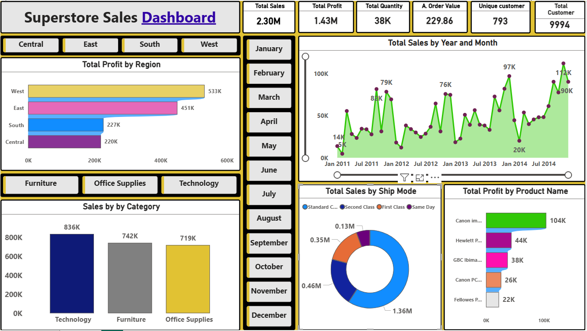

## 📊 Superstore Sales Dashboard
  
This dashboard provides a comprehensive overview of Superstore sales performance, 
helping analyze trends, profitability, and customer behavior across different regions and time periods.  

## 🖼️ Dashboard Preview
   

## 🔍 Key Insights
💰 Total Sales: 2.30M   
📈 Total Profit: 1.43M  
📦 Total Quantity: 38K  
👥 Total Customers: 9994     
## 📌 Features   
Region-wise Profit Analysis   
Sales Trend Over Time  
Category-wise Sales  
Ship Mode Analysis  
Top Products by Profit     

Interactive Filters:
  
 Region   
 Month  

## 🛠️ Tools & Technologies
Power BI – Dashboard creation   
Microsoft Excel – Data source  
Data Cleaning & Transformation  
Data Visualization Techniques  

##🎯 Purpose
Identify top-performing regions and products  
Track sales trends over time  
Improve business decision-making  
